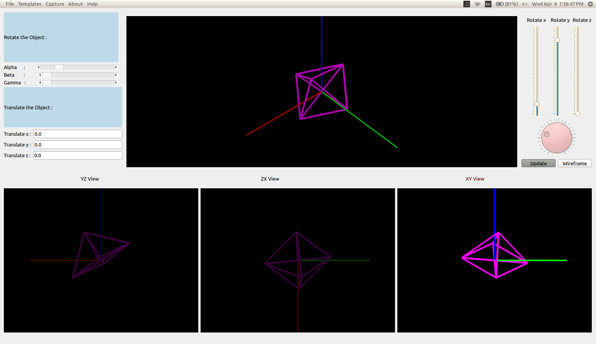

# CAD Software 
This repository hosts the Mathematical Model, Functional Model, Design Documentation & the source code to the 3D CAD Software for Development in Engineering Drawing. </br> 
This tool is made as a part of COP290 course under Prof. Subhashish Bannerjee. </br>

## Aim
We are going to design and implement a Software Package for Engineering drawing that shall be described and portrayed in a series of five steps to finely work out the design, analysis and the modelling.

The package will have the following functionalities:

1. We will be able to interactively input or read from a file either
	• An isometric drawing and a 3D object model
	• Projections onto any cross section
2. For a given 3D model description, the software will be able to generate projections onto the three orthographic planes.
3. Given two or more projections, we will be able to interactively re-construct the 3D model of the object and produce the isometric view along any view direction.

## Functionalities
1. Read/Open ```2D/3D model``` from files.
2. Save ```2D/3D model``` in file.
3. Implicit conversion from 2D file[Projections] to 3D.

## UI Interfaces


## Directory Structure
                                       
.                                       
├── docs                                       
│   ├── html                                       
│   │   └── search                                       
│   ├── latex                                       
│   └── xml                                       
├── Make                                       
├── mathClassesAndDocs                                       
│   └── doc                                       
│       └── latex                                       
├── mathClasses & Doc                                       
│   ├── doc                                       
│   │   ├── html                                       
│   │   │   └── search                                       
│   │   ├── latex                                       
│   │   ├── man                                       
│   │   │   └── man3                                       
│   │   ├── rtf                                       
│   │   └── xml                                       
│   ├── include                                       
│   └── src                                       
├── models                                       
├── screens                                       
├── src                                       
└── templates                                       
                                      
## Project Description  
Main Classes and UI are in src/ folder [Documented in docs]                </br> 
Math Classes are the conceptual classes. [Documented in the subfolder]     </br> 

Following is the description of the directories:

docs : Contains the html, latex, xml documentation of the structure of the software in the respective formats. 
models : Contains the description of mathematics used for building the software and the functional model containing the StarUML structure and the design interface of the software.
src : Main files containing all the software files including the .h and .cpp files.

## Platform compatibility
Built and tested on Ubuntu-16.04.

## Technologies Used
1. **QT** : Cross-platform application framework that is used for developing application software.
2. **Open-GL** : Cross-language, cross-platform application programming interface for rendering 2D and 3D vector graphics.
3. **C++ std-11** : General-purpose programming language.

## Compilation and Execution Instructions
Following are the instructions to run the application software:

1. Run by
```
cd Make && ./CadSoftware
```
2. Compiling with Makefile, but this makefile is configured for my desktop environment.
```
cd Make && make
```
3. To execute, run
```
./CadSoftware
```
4. In case, ```Make``` throws errors becase of difference in build environments, compile from source with qmake :
```
qmake CadSoftware.pro -spec linux-g++ CONFIG+=debug CONFIG+=qml_debug
```

## Authors:
Udit Jain       - 2016CS10327 [@udit01](https://github.com/udit01/)         </br>
Shashank Goel   - 2016CS10332 [@ShashuBoy](https://github.com/ShashuBoy)    </br>

Department of Computer Science and Technology
Indian Institute of Technology, Delhi
